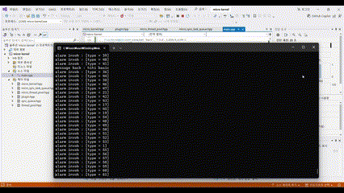

# 마이크로 커널 기반 플러그인 시스템 설계 및 구현 (C++)
 

## 1️⃣ 프로젝트 개요

### 목적

C++로 효율적이고 확장 가능한 마이크로 커널 기반 플러그인 시스템 구현
플러그인의 동적 추가 및 제거, 메시지 교환, 스레드 관리 등을 지원

### 사용 기술
C++ 표준 라이브러리(std::thread, std::mutex, std::shared_mutex, std::condition_variable)
스마트 포인터(std::shared_ptr)
템플릿 및 인터페이스 기반 설계

## 2️⃣ 시스템 구조
### MicroKernel
플러그인 관리, 메시지 및 스트림 전달 담당
멀티 스레드 환경에서 플러그인의 작업을 스케줄링 및 실행

### Plugin
독립적 기능을 제공하는 모듈
공통 인터페이스(IPlugin)를 상속하여 구현
메시지 수신 및 전송, 초기화, 종료 등 수행

### ThreadPool
MicroKernelThreadPool: 플러그인의 작업을 비동기로 실행

### PluginStream
플러그인 간 스트림 기반 데이터 통신 지원

## 3️⃣ 주요 클래스 및 인터페이스 설명
### 📌 MicroKernel 클래스
역할: 플러그인 등록, 관리 및 메시지 전달 제어
주요 함수
- plugin_register(): 플러그인 등록
- plugin_unregister(): 플러그인 제거
- message_dispatch(): 플러그인 간 메시지 전달

      template<typename T>
      class MicroKernel : public IMicroKernelServices<T> { /* ... */ };

### 📌 IPlugin 인터페이스 및 구현 (BasicPlugin, AlarmPlugin)
역할: 플러그인의 공통 기능 정의
주요 함수
- plugin_init(): 초기화
- plugin_start(): 시작
- plugin_task(): 주기적 실행 작업
- message(): 메시지 처리

    template<typename T>
    class MicroKernel : public IMicroKernelServices<T> { /* ... */ };

### 📌 IPlugin 인터페이스 및 구현 (BasicPlugin, AlarmPlugin)
역할: 플러그인의 공통 기능 정의
주요 함수
- plugin_init(): 초기화
- plugin_start(): 시작
- plugin_task(): 주기적 실행 작업
- message(): 메시지 처리

      bool BasicPlugin::plugin_task() {
        PluginDataT req = {/* ... */};
        PluginDataT res = {/* ... */};
        
        get_micro_kernel_service()->message_dispatch(from, E_DOMAIN_ALARM, req, res);
      
        std::cout << "response: " << (char*)res.data << std::endl;
        return true;
      }

### 📌 PluginStream 클래스
역할: 플러그인 간 지속적 데이터 스트림 전송 지원
주요 함수
- send(), recv(): 데이터 송수신

      class PluginStream : public IPluginStream<domain_type> { /* ... */ };

## 4️⃣ 스레드 및 동기화 기법
### Thread Pool
- 작업의 비동기 처리를 위한 MicroKernelThreadPool
- 작업 큐(MicroSyncTaskQueue) 활용

### 동기화
- std::mutex: 출력 및 데이터 접근 동기화
- std::shared_mutex: 읽기/쓰기 동시 접근 제어
- std::condition_variable: 스레드의 효율적 대기 및 깨우기 제어

      std::mutex g_cout_mutex;
      std::lock_guard<std::mutex> lock(g_cout_mutex);
      std::cout << "Thread-safe output\n";

## 5️⃣ 메시지 전달 방식
- 플러그인은 message_dispatch()를 통해 상호 통신
- 메시지 구조 (PluginMessage)

        template<typename T>
        struct PluginMessage {
          PluginKey<T> from;
          PluginKey<T> to;
          PluginDataT data;
        };

  
## 6️⃣ 실행 흐름 및 예제 시나리오
📝 예제 시나리오
- 마이크로 커널 생성 및 플러그인 등록
  - BasicPlugin 1개, AlarmPlugin 여러 개(1~99개) 등록
- 플러그인의 초기화 → 시작 → 주기적 작업(plugin_task) 수행
- BasicPlugin이 AlarmPlugin에게 메시지 전달, AlarmPlugin이 응답
- 프로그램 종료 시 플러그인의 종료 작업(plugin_stop, plugin_exit) 수행

📄 주요 실행 흐름 (main 함수)

      int main(void) {
        auto thread_pool = std::make_shared<MicroKernelThreadPool>();
        auto micro_kernel = std::make_shared<MicroKernel<domain_type>>(200, thread_pool);
      
        // 플러그인 등록
        micro_kernel->plugin_register(std::make_shared<BasicPlugin>(basic_key));
        for (int i = 1; i < 100; ++i) {
          alarm_key.key = (domain_type)i;
          micro_kernel->plugin_register(std::make_shared<AlarmPlugin>(alarm_key));
        }
      
        // 마이크로 커널 실행
        micro_kernel->run();
      
        return 0;
      }

